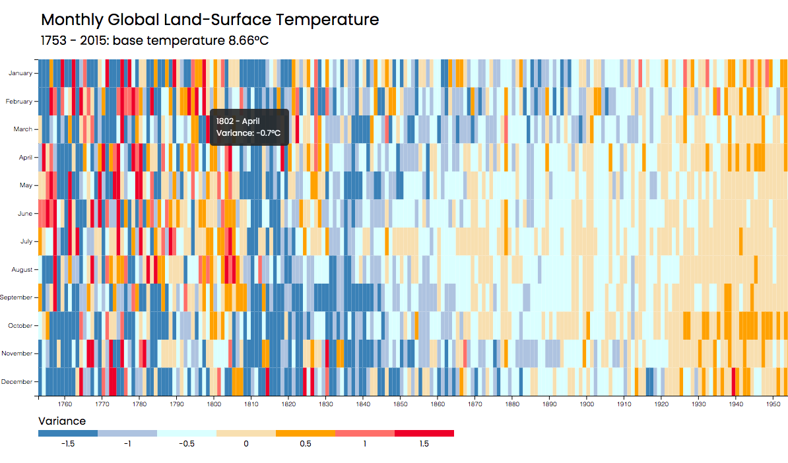

# D3.js Monthly Temperature Heat Map

This code was created as part of the freeCodeCamp [Data Visualization certification](https://www.freecodecamp.org/learn/data-visualization).
 
This is a D3.js implementation of a Heat Map used for visualizing data related to monthly global land-surface temperature. The Heat Map is color-coded to represent different temperature variances.

## Libraries
This code uses the following libraries:

[D3.js](https://d3js.org/): a JavaScript library for manipulating documents based on data.

## Data Source
The data used in this project is from this GitHub [repository](https://raw.githubusercontent.com/FreeCodeCamp/ProjectReferenceData/master/global-temperature.json). It contains the monthly global land-surface temperature data from 1753 to 2015.

## Usage
The graph shows the monthly global land-surface temperature, with the x-axis representing years and the y-axis representing months. Each block in the graph represents the temperature for a particular month in a particular year.
 
The color of each block represents the variance from the base temperature for that month, according to the legend. Hovering over a block displays a tooltip showing the year, month, and temperature.

## Screenshot

Here is an example of what the heat map looks like when you run the code:

## Code
1. The heading and SVG elements are created.
2. The legend and its components are created.
3. The data is obtained from the URL.
4. The heading and description are set up.
5. The x-axis and y-axis are set up using the obtained data.
6. The graph elements are created and filled with data.
7. A tooltip is set up to display when hovering over data points.

## Credits
This code was developed by me and was based on the examples and instructions provided by the [freeCodeCamp](https://www.freecodecamp.org/) platform.